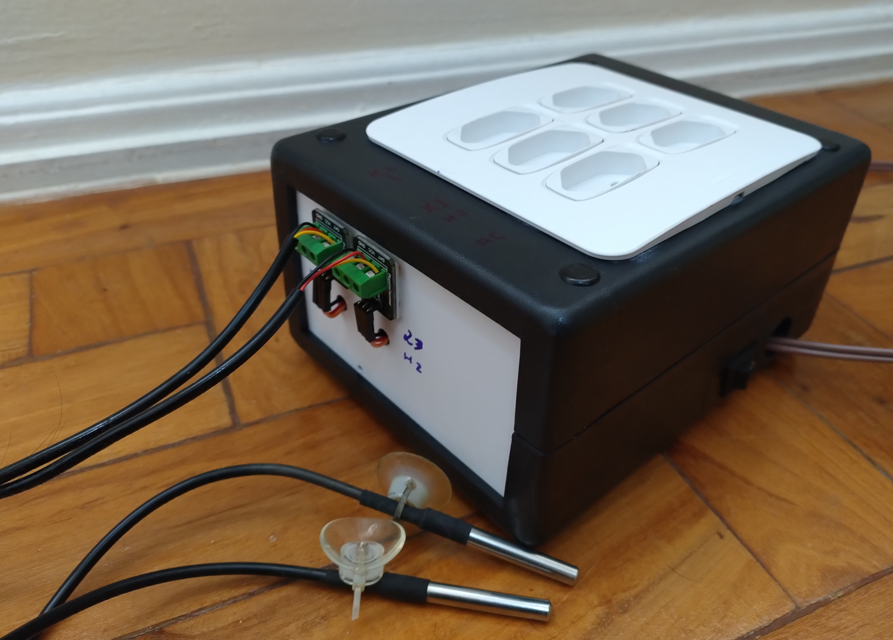
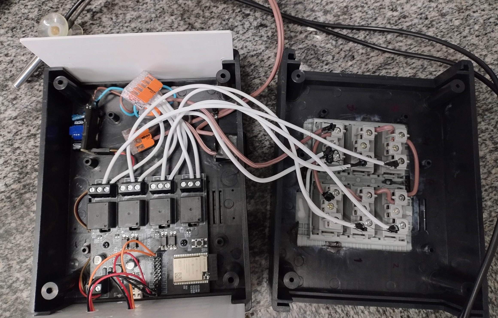
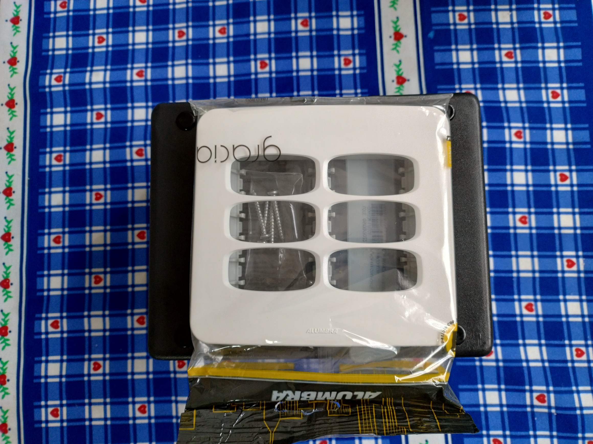
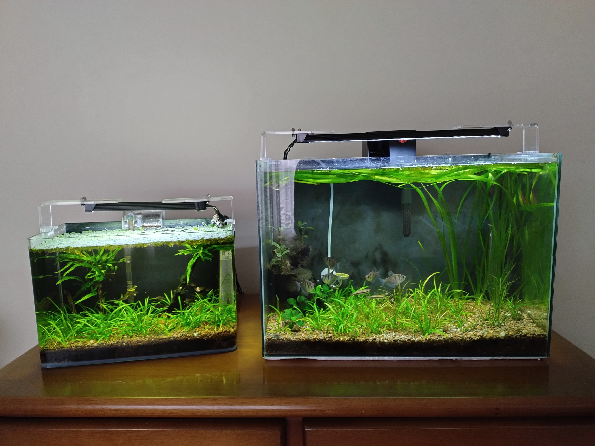

# Smart Aquarium - arduino-smart-aquarium

This ESP32 T-Relay device is intended to monitor and control my two planted nano aquariums. It uses the ds18b20 sensor to measure the water temperature, has a thermostat function and also has an on/off schedule for lights and CO2 solenoid valve.

For this project, I chose to use the ThingSpeak IoT platform. See the dashboard here: <https://thingspeak.com/channels/2421172>

Basically, this project applies to my two planted nano aquariums, one 20l and the other 45l, which has CO2 injection through a Zrdr stainless steel cylinder and external Drop Checker. Each one has two 6500K LED bars and simple heaters that are activated according to a target temperature (thermostat function).

## Screenshots

This DIY device consists of a Shako HT200 plastic box, a 4x4 set with 6 sockets, LILYGO T-Relay ESP32, waterproof ds18b20 sensors, 12V power supply, wires, WAGO connectors and scraps.

 
 
